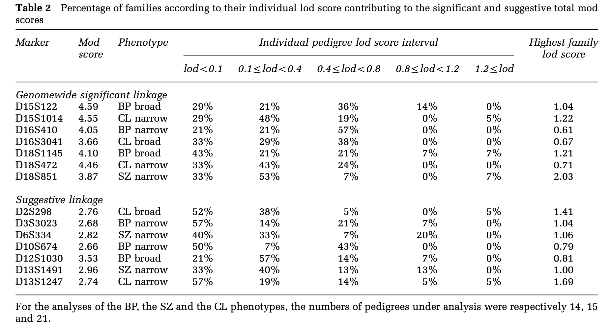
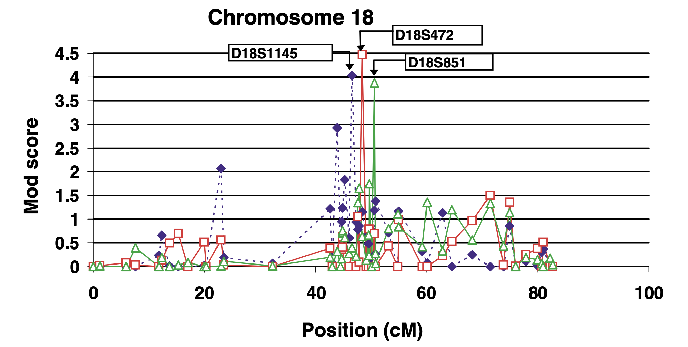

```{r setup, include=FALSE}
knitr::opts_chunk$set(echo = FALSE, message = FALSE, warning = FALSE)
```

# Part I: Background & Study Pedigrees

## Study Objective

**Primary Goal:** Identify shared and disorder-specific susceptibility loci for schizophrenia (SZ) and bipolar disorder (BP)

\vspace{0.3cm}

**Key Questions:**

-   Do SZ and BP **share** common genetic susceptibility loci?
-   Are there loci **specific** to each disorder?

\vspace{0.3cm}

**Why study SZ and BP together?**

-   Family studies show co-aggregation of SZ and BP within pedigrees
-   Previous linkage studies analyzed the disorders separately
-   Separate analysis may cause diagnostic misclassification to break segregation patterns within pedigrees

## Background: The Diseases

**Bipolar I Disorder (BP):**

-   Mood disorder with manic and depressive episodes
-   Lifetime prevalence of 0.6%; Bipolar spectrum disorders: 1-2%
-   **Highly heritable (60-85%)**
-   \~70% reported psychotic symptoms

**Schizophrenia (SZ):**

-   Key features include hallucinations, delusions, disorganized speech, abnormal motor behavior, diminished emotional expression
-   Lifetime prevalence in population is 0.3-0.7%
-   **High heritability (70-80%)**
-   **Schizoaffective Disorder:**
    -   Schizophrenia with mood symptoms (mania and/or depression)
    -   lifetime prevalence is \~0.3%

## **Complex Genetic Disorders**

-   Non-Mendelian inheritance with incomplete penetrance
    -   Carrying a susceptibility allele does not guarantee disease expression
-   Genetic heterogeneity
    -   Similar clinical phenotypes may result from different susceptibility loci or mutations across families
-   Phenocopies
    -   Similar clinical phenotype induced by enviromental factors
    -   Eg., prenatal or perinatal adversities including stress, infection, or other medical complications
-   Other risk factors: neurodevelopmental factors, substance exposure, psychosocial stressors, etc.

## Study Population: Eastern Quebec Families

**Sample Characteristics:**

-   21 multigenerational families from Eastern Quebec, Canada
-   Average of 6 affected individuals (SZ or BP) per family
-   N = 480 family members (DNA available)
-   47 deceased affected ancestors included in pedigree analysis

\vspace{0.3cm}

**Family Selection Criteria:**

-   At least one first-degree relative with same disorder as proband
-   At least two additional affected relatives (first/second/third-degree)
-   At least four affected members per family

\vspace{0.3cm}

**Family Composition:**

-   7 SZ pedigrees (85%+ affected by SZ spectrum among ill members)
-   6 BP pedigrees (85%+ affected by BP spectrum among ill members)
-   8 mixed pedigrees (both SZ and BP)

# Part II: Methods Overview

## Methods: The Big Picture

**Overall Analytical Strategy:**

```         
Step 1: Define phenotypes (who is "affected"?)
Step 2: Genotype families using microsatellite markers
Step 3: Perform model-based linkage analysis
Step 4: Calculate LOD scores across genome
Step 5: Apply significance thresholds (multiple testing)
Step 6: Identify candidate susceptibility regions
```

## Background Concept: What is Linkage?

**Linkage** = The tendency for genes/markers close together on a chromosome to be inherited together

-   Linkage analysis requires pedigree data because it detects co-segregation of chromosomal regions through meioses

\vspace{0.3cm}

**Key Principle (from Lecture 4):**

-   If a marker is **physically close** to a disease gene, they will **co-segregate** within families
-   The closer they are, the less likely recombination occurs between them

\vspace{0.3cm}

**Recombination Fraction (**$\theta$):

-   $\theta$ = probability of recombination between two loci
-   $\theta = 0.5$: loci are unlinked (different chromosomes or far apart)
-   $\theta < 0.5$: loci are linked
-   $\theta = 0$: loci are completely linked (no recombination)

## Background Concept: Microsatellite Markers

**What are microsatellites?**

-   Short tandem repeats (STRs) of 2-4 nucleotides (e.g., CA-CA-CA-CA, or CA-CA, etc.)
-   Highly polymorphic: many different alleles in population
-   Scattered throughout the genome

**Why use microsatellites for linkage analysis?**

-   High heterozygosity $\rightarrow$ more **informative meioses**
-   A pedigree contributes to LOD score only if key individuals are heterozygous
-   More alleles = better ability to track inheritance

**This study used:**

-   607 microsatellite markers
-   350 markers at 10cM resolution (initial scan)
-   257 additional markers in promising regions

## Methods Step 1: Phenotype Definitions

**Three diagnostic classes analyzed:**

| Phenotype | Narrow Definition | Broad Definition |
|-------------------|---------------------------|--------------------------|
| **SZ** | SZ only (N=71) | SZ+schizophreniform+ schizotypal (N=81) |
| **BP** | BP I only (N=48) | BP I+BP II+recurrent depression (N=72) |
| **CL** | SZ + BP I + schizoaffective (N=134) | CL narrow+depression +schizotypal (N=169) |

**CL = "Common Locus" phenotype**

-   Combines SZ and BP phenotypes
-   Tests hypothesis that some loci are shared by both disorders

**Diagnostic blindness**: ensures that clinical diagnosis is assigned independently of family structure

## Methods Step 2: Transmission Models

**Model-based linkage analysis requires specifying:**

1.  **Mode of inheritance:** Dominant vs. Recessive
2.  **Disease allele frequency:** How common is the risk allele?
3.  **Penetrance:** P(affected \| genotype)

**Two models used in this study:**

| Parameter                | Dominant Model | Recessive Model |
|--------------------------|----------------|-----------------|
| Disease allele frequency | 0.01           | 0.10            |
| Penetrance (high age)    | 0.70           | 0.70            |
| Phenocopy rate           | 0.20           | 0.10            |

**Why test multiple models?**

-   True inheritance pattern is unknown for complex diseases
-   Maximizing over models increases power but also Type I error

## Background Concept: LOD Score

**LOD (Log of Odds) Score** measures evidence for linkage:

$$LOD(\theta) = \log_{10} \frac{L(\theta)}{L(\theta = 0.5)} = \log_{10} \frac{\text{Likelihood under linkage}}{\text{Likelihood under no linkage}}$$

\vspace{0.3cm}

When penetrance $f < 1$ or phenocopy rate $f_0 > 0$, the likelihood:

$$L(\theta) = \sum_{\text{genotypes}} P(\text{phenotypes} | \text{genotypes}, f, f_0) \cdot P(\text{genotypes} | \theta)$$

where for each individual $i$: $P(\text{phenotypes} | \text{genotypes}, f, f_0) = \prod_{i} P(Y_i | G_i)$

$$P(Y_i | G_i) = \begin{cases} f^{Y_i}(1-f)^{1-Y_i} & \text{if } G_i = \text{carrier} \\ f_0^{Y_i}(1-f_0)^{1-Y_i} & \text{if } G_i = \text{non-carrier} \end{cases}$$

## Methods Step 3: Linkage Analysis Details

**Two-point vs. Multipoint Analysis:**

-   **Two-point:** Tests linkage between disease and ONE marker
-   **Three-point (multipoint):** Uses flanking markers together
    -   More informative, extracts more information
    -   Each marker included in two three-point analyses

**Mod Score Approach:**

-   Maximize LOD score over $\theta$ AND over model parameters
-   $$\text{Mod Score} = \max_{\theta, \text{models}} LOD(\theta)$$
-   Tests 8 combinations: 2 phenotype levels (narrow *vs* broad) $\times$ 2 transmission models (dominant *vs* recessive) $\times$ 2 analysis types (affect/unaffected *vs* affected-only)

\vspace{0.3cm}

**Software:** FASTLINK (version of LINKAGE)

## Methods Step 4: Multiple Testing Correction

**The Problem:**

-   607 markers $\times$ 3 phenotypes $\times$ 8 model combinations = many tests!
-   High risk of false positives

**Solution: Lander & Kruglyak (1995) Thresholds**

| Category         | Z-score    | Interpretation                          |
|------------------|------------|-----------------------------------------|
| **Significant**  | $\geq$ 4.0 | Genomewide significant (p \< 0.05)      |
| **Suggestive**   | $\geq$ 2.6 | Expected once per genome scan by chance |
| **Confirmatory** | $\geq$ 1.9 | Only in regions with prior evidence     |

**Additional correction in this study:**

-   Raised thresholds by 0.70 (following Hodge et al.)
-   Because: 24 non-independent analyses per marker

## Methods Step 5: Heterogeneity Analysis

**What is genetic heterogeneity?**

-   Same phenotype caused by different genes in different families
-   Common in complex diseases

\vspace{0.3cm}

**Problem:** If only some families are linked to a locus, the overall LOD score may be diluted

\vspace{0.3cm}

**Solution: Admixture Model (HOMOG program)**

-   Estimates proportion of families linked ($\alpha$)
-   Calculates HLOD (heterogeneity LOD)
-   Applied to signals with mod score \> 1.9

$$HLOD = \log_{10} \left[ \alpha \cdot L(\theta) + (1-\alpha) \cdot L(\theta=0.5) \right] - \log_{10} L(\theta=0.5)$$

# Part III: Results & Figures

## Genetic Nomenclature: Loci and Markers

-   **Chromosomal Location** (e.g., 15q11.1)
    -   **15**: the chromosome number

    -   **q**: the "long arm" of the chromosome (p stands for the "short arm")

    -   **11.1**: the specific band and sub-band on that arm, numbered in increasing order as the distance from the centromere (the center) increases
-   **Genetic Markers** (e.g., D15S122)
    -   **D**: DNA

    -   **15**: located on Chromosome 15

    -   **S**: a single-copy sequence (a unique genomic locus)

    -   **122**: the unique ID number for this specific marker
-   **The Relationship**:
    -   **15q11.1** defines a broad chromosomal region

    -   **D15S122** is a precise genetic marker within that region, used to test linkage to a nearby disease locus

## Results (see Table 1)

-   **Significant Linkage Findings** (MOD Score $\geq$ 4.0):

    -   **BP**: 15q11.1 (D15S122), 18q12.3 (D18S1145), 16p12.3 (D16S410)

    -   **CL**: 15q26 (D15S1014), 18q21.1 (D18S472)

-   **Suggestive Linkage Findings** (MOD Score $\geq$ 2.6):

    -   **BP**: 12q23.1 (D12S1030), 3q21.2 (D3S3023), 10p13 (D10S674)

    -   **SZ**: 6p22.3 (D6S334), 18q21.1 (D18S851), 13q13.3 (D13S1491)

    -   **CL**: 16p13.1 (D16S3041), 2q22.1 (D2S298), 13q14.1 (D13S1247)

-   **Novelty and Replication** (see Table 3):

    -   **Novel Discovery**: the linkage signal at **15q26** for the shared phenotype

    -   **Confirmatory Evidence** (MOD score $\geq$ 1.9): the finding at **3q21.2** for BP, **6p22.3** for SZ, **10p15-p11** for BP and SZ, **18q12.3-q32** for BP and SZ, etc.

## Table 2: Family Contributions to the Genetic Signal

-   The linkage signal is supported by several pedigrees rather than driven by a single influential family

```{r, echo=FALSE, out.width="88%", fig.align="center"}

```

## Figure 1: Visualizing Linkage across Chromosomes

-   **X-axis**: physical distance along the chromosome (measured in cM)

-   **Y-axis**: MOD score (the strength of the evidence)

-   **Example**: Chromosome 18 shows overlapping linkage peaks for SZ, BP and the combined phenotype, suggesting a shared susceptibility locus rather than diagnosis-specific genes

```{r, echo=FALSE, out.width="82%", fig.align="center"}

```

# Part IV: Discussion

## **Evidence for Shared Loci Between SZ and BP**

-   Data indicates overlapping susceptibility regions, suggesting that SZ and BP may share a common biological etiology in specific areas

-   **Key Shared Hotspots**:

    -   **Chromosome 18q**: showed consistent significant or suggestive linkage across SZ, BP, and combined phenotypes

    -   **Chromosome 15q**: suggested the presence of one or more susceptibility genes contributing to either or both disorders

    -   **Chromosome 16p**: primarily driven by BP and the shared phenotype, indicating a potential shared susceptibility locus; absence of a signal for SZ likely reflects diagnostic misclassification within pedigrees

-   These results strongly support the hypothesis that some genetic risk factors are **not specific to one diagnosis** but are shared across the spectrum of these two major psychoses

## Limitations

**1. Statistical Thresholds**

-   Unclear if these criteria fit a small number of large families
-   The effect of a two-step scan (sparse then dense) is hard to simulate

\vspace{0.3cm}

**2. Sensitivity of Heterogeneity**

-   Current tests may fail to detect between-family heterogeneity

\vspace{0.3cm}

**3. Complexity of Replication**

-   Difficult to define "true replication" across studies due to variations in:

    -   Sampling & Diagnostics
    -   Statistical methods & Genetic markers

## Implications & Future Direction

-   **Combination Model**: SZ and BP specificity arises from unique combinations of multiple shared genes

-   **Modifier Gene Model**: SZ and BP share core genes, and specific modifier genes determine the final clinical phenotype

    -   **Necessary but Not Sufficient**: Genes at loci like **6p22 (SZ)** or **16p12 (BP)** require interactions with other genes to trigger the disorder

    -   **Affected-Only *vs*** **Affect/Unaffected**: More significant signals in AO analysis compared to AU

-   **Future Directions**

    -   The presence of multiple signals in one sample may allow for the study of gene-gene interactions (epistases)
    -   Expand statistical power using a second sample of 500 members, ultimately identifying defective genes and paving the way for new treatments

## Questions for Class Discussion

1.  Why did the authors use **model-based** (parametric) linkage analysis instead of model-free methods for this study? What are the trade-offs?

2.  The authors used both **narrow and broad** phenotype definitions. How might the phenotype definitions affect LOD scores and power?

3.  We learned that LOD scores require specifying **penetrance** values. This study used age-dependent penetrance. Why is this important for late-onset disorders?

4.  The maximum family LOD score was only \~2.0 (Table 2), yet the combined scores reached significance. What does this tell us about **genetic heterogeneity** of these disorders?

5.  This is a **two-stage design** (initial sparse scan + dense follow-up). What are the advantages of this approach compared to performing dense genotyping from the start?
